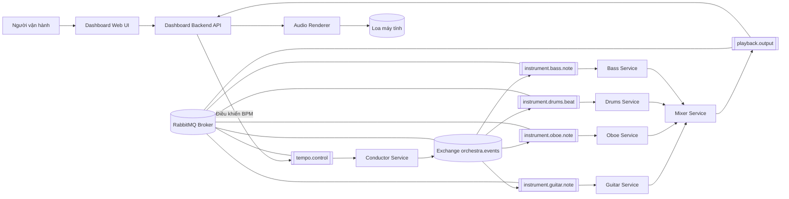
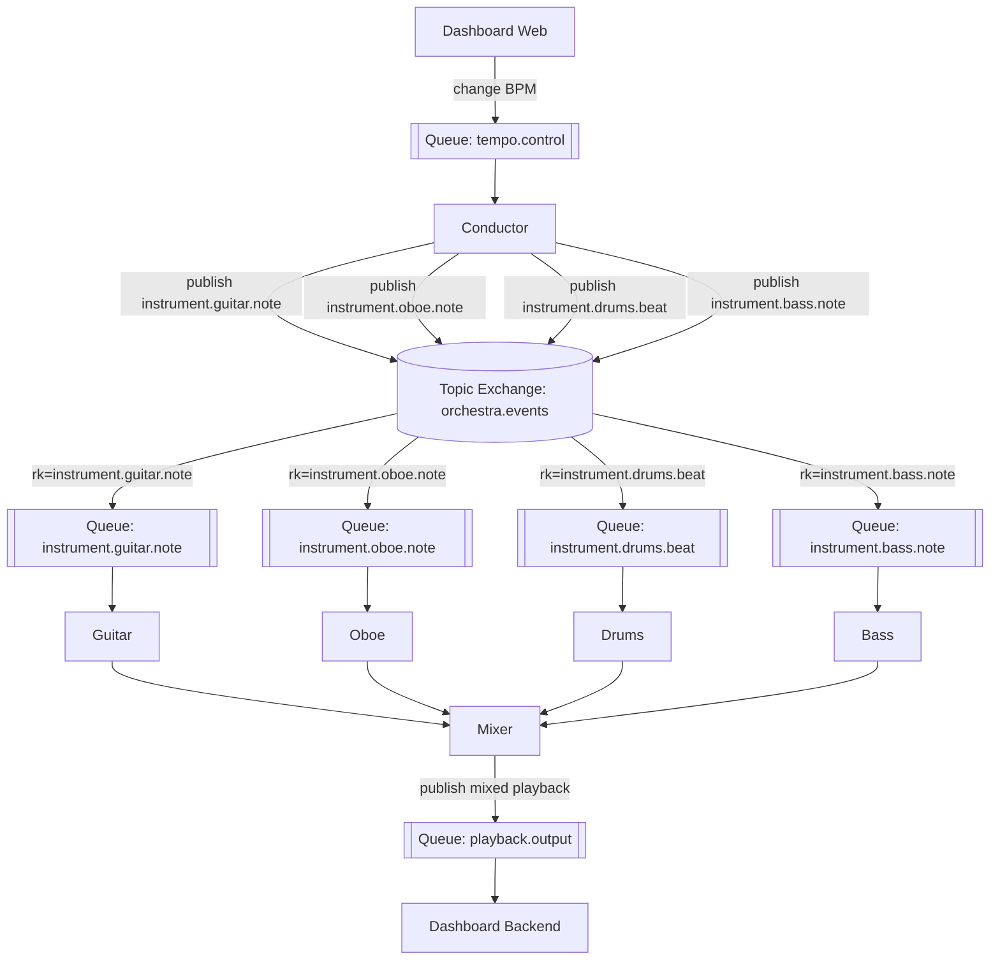
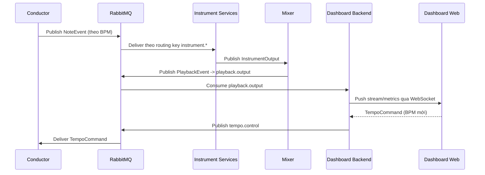
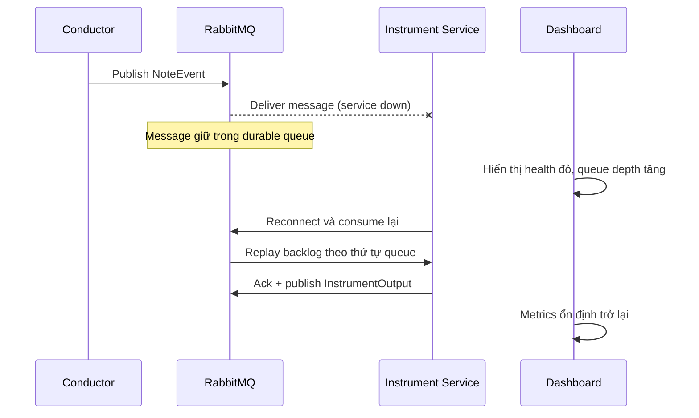
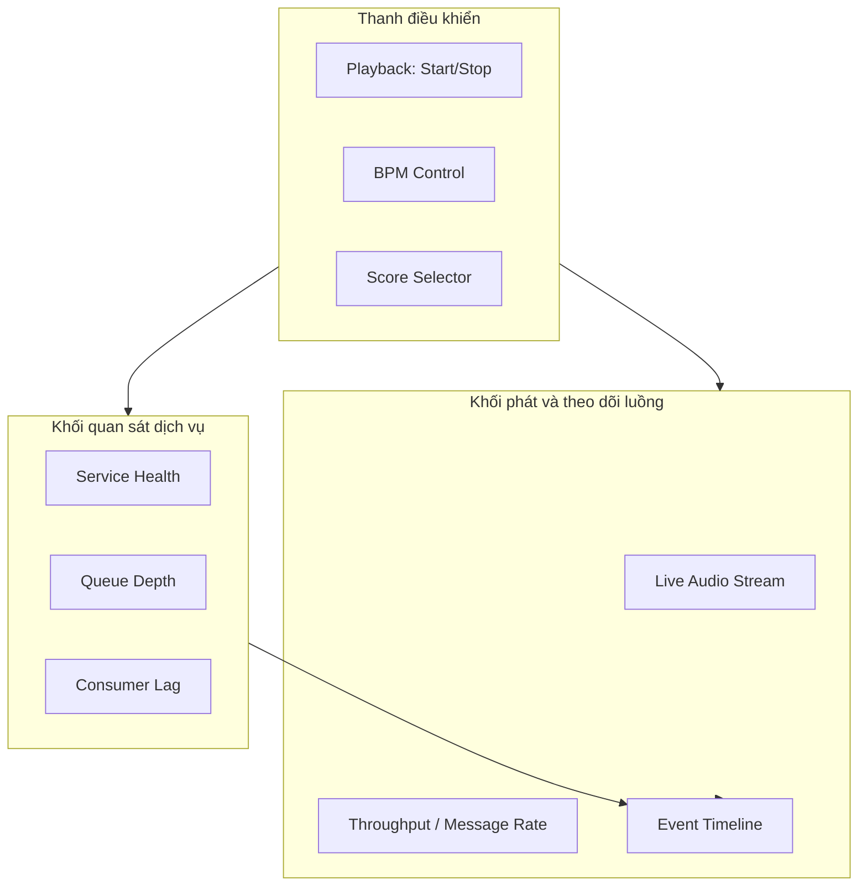
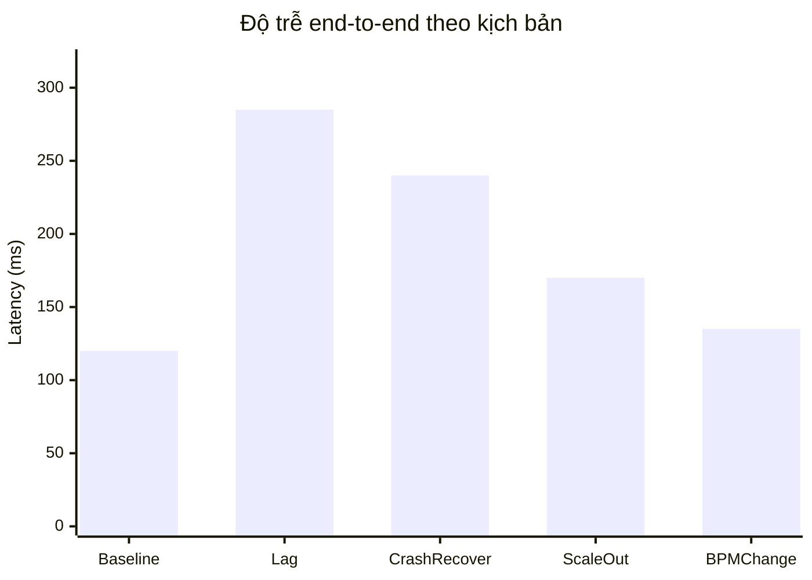
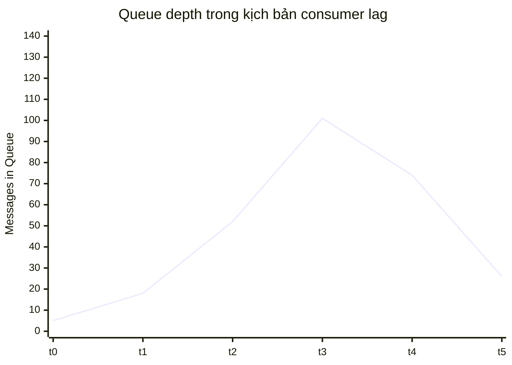

**HỌC VIỆN CÔNG NGHỆ BƯU CHÍNH VIỄN THÔNG**

**KHOA CÔNG NGHỆ THÔNG TIN I**

**BÁO CÁO BÀI TẬP LỚN**

**MÔN CÁC HỆ THỐNG PHÂN TÁN**

**ĐỀ TÀI: THIẾT KẾ HỆ THỐNG MICROSERVICES CHO GIÀN NHẠC GIAO HƯỞNG SỬ DỤNG RABBITMQ**

|Nhóm lớp:|05|
| :- | :- |
|Nhóm bài tập lớn:|04|
|Giáo viên hướng dẫn:|PGS.TS. Đỗ Trung Tuấn|
|Sinh viên thực hiện:||
|Trần Hữu Phúc|B22DCCN634|
|Bùi Ngọc Vũ|B22DCCN910|
|Lương Tuấn Anh|B22DCCN021|
|Lương Tiến Đạt|B22DCCN190|
|Hoàng Minh Tuấn|B22DCCN753|

**HÀ NỘI, 2026**

# **LỜI CẢM ƠN**

Nhóm tác giả xin trân trọng cảm ơn Ban Giám hiệu Học viện Công nghệ Bưu chính Viễn thông, Khoa Công nghệ Thông tin I và toàn thể quý thầy cô đã tạo điều kiện về môi trường học thuật, cơ sở vật chất và định hướng chuyên môn trong suốt quá trình học tập.

Nhóm xin bày tỏ lòng biết ơn sâu sắc tới PGS.TS. Đỗ Trung Tuấn, giảng viên hướng dẫn môn Các hệ thống phân tán, đã tận tình góp ý về phương pháp nghiên cứu, cách tiếp cận bài toán và tiêu chí đánh giá thực nghiệm. Những nhận xét có tính học thuật và thực tiễn của thầy là cơ sở quan trọng để nhóm hoàn thiện báo cáo này.

Nhóm cũng chân thành cảm ơn gia đình, bạn bè và các thành viên trong lớp đã hỗ trợ về tinh thần, thảo luận kỹ thuật và phản biện trong quá trình xây dựng hệ thống. Sự đồng hành đó giúp nhóm duy trì tiến độ, nâng cao chất lượng sản phẩm và hoàn thiện kỹ năng làm việc nhóm.

Mặc dù đã nỗ lực trong nghiên cứu, triển khai và trình bày, báo cáo khó tránh khỏi thiếu sót. Nhóm kính mong tiếp tục nhận được ý kiến đóng góp của quý thầy cô để hoàn thiện hơn trong các nghiên cứu tiếp theo.

# **THÀNH VIÊN NHÓM**

| STT | Họ và tên | MSSV | Vai trò chính | Nhiệm vụ đã thực hiện |
| --- | --- | --- | --- | --- |
| 1 | Trần Hữu Phúc | B22DCCN634 | Trưởng nhóm, Conductor | Thiết kế luồng điều phối, xử lý MIDI, phát sự kiện theo BPM, tổng hợp báo cáo |
| 2 | Bùi Ngọc Vũ | B22DCCN910 | Instrument services | Phát triển các service nhạc cụ (guitar, oboe, drums, bass), kiểm thử hợp đồng message |
| 3 | Lương Tuấn Anh | B22DCCN021 | Mixer service | Thiết kế logic trộn luồng sự kiện, chuẩn hóa output playback, đo kiểm độ trễ |
| 4 | Lương Tiến Đạt | B22DCCN190 | Dashboard backend | Xây dựng API/metrics/WebSocket, render audio cục bộ, tích hợp cơ sở dữ liệu |
| 5 | Hoàng Minh Tuấn | B22DCCN753 | Triển khai và quan sát hệ thống | Thiết lập Docker Compose đa nút, kịch bản fault injection, tài liệu vận hành |

# **MỤC LỤC**

- LỜI CẢM ƠN
- THÀNH VIÊN NHÓM
- DANH SÁCH TỪ VIẾT TẮT
- DANH SÁCH HÌNH ẢNH, BẢNG, BIỂU
- LỜI MỞ ĐẦU
- CHƯƠNG 1. KIẾN THỨC NỀN (CÁC KHÁI NIỆM)
- CHƯƠNG 2. PHÂN TÍCH THIẾT KẾ HỆ THỐNG
- CHƯƠNG 3. THỰC NGHIỆM
- CHƯƠNG 4. KẾT LUẬN
- TÀI LIỆU THAM KHẢO

# **DANH SÁCH TỪ VIẾT TẮT**

| Từ viết tắt | Nghĩa tiếng Anh | Nghĩa tiếng Việt |
| :-: | :-: | :-: |
| AMQP | Advanced Message Queuing Protocol | Giao thức hàng đợi thông điệp nâng cao |
| API | Application Programming Interface | Giao diện lập trình ứng dụng |
| BPM | Beats Per Minute | Số nhịp trên phút |
| DLQ | Dead Letter Queue | Hàng đợi thư chết |
| FR | Functional Requirement | Yêu cầu chức năng |
| HTTP | HyperText Transfer Protocol | Giao thức truyền tải siêu văn bản |
| ISO | International Organization for Standardization | Tổ chức Tiêu chuẩn hóa Quốc tế |
| LAN | Local Area Network | Mạng cục bộ |
| MIDI | Musical Instrument Digital Interface | Chuẩn dữ liệu nhạc số |
| NFR | Non-functional Requirement | Yêu cầu phi chức năng |
| UI | User Interface | Giao diện người dùng |
| UUID | Universally Unique Identifier | Định danh duy nhất toàn cục |

# **DANH SÁCH HÌNH ẢNH, BẢNG, BIỂU**

- Hình 2.1. Kiến trúc logic tổng thể hệ thống Orchestra Microservices.
- Hình 2.2. Luồng sự kiện từ Conductor tới Dashboard playback.
- Hình 2.3. Topology RabbitMQ (exchange, queue, routing key).
- Hình 2.4. Trình tự xử lý khi xảy ra lỗi và phục hồi dịch vụ.
- Hình 3.1. Giao diện Dashboard theo dõi metrics thời gian thực.
- Hình 3.2. Biểu đồ độ trễ đầu-cuối theo các kịch bản tải.
- Hình 3.3. Biểu đồ queue depth khi xảy ra consumer lag.
- Bảng 2.1. Ánh xạ bài toán âm nhạc và khái niệm hệ thống phân tán.
- Bảng 2.2. Đặc tả message `NoteEvent`.
- Bảng 2.3. Ma trận yêu cầu - quyết định thiết kế.
- Bảng 2.4. Đặc tả API điều khiển và quan sát hệ thống.
- Bảng 3.1. Cấu hình môi trường thực nghiệm.
- Bảng 3.2. Kết quả đo kiểm theo yêu cầu NFR.

# **LỜI MỞ ĐẦU**

Trong bối cảnh các hệ thống phần mềm hiện đại ngày càng chuyển dịch từ kiến trúc nguyên khối sang kiến trúc phân tán, việc giảng dạy và học tập môn Các hệ thống phân tán đòi hỏi các mô hình minh họa trực quan, dễ quan sát và dễ tái hiện. Tuy nhiên, nhiều khái niệm cốt lõi như trễ tiêu thụ (consumer lag), mất đồng bộ, quá tải hàng đợi hay phục hồi sau lỗi thường khó cảm nhận nếu chỉ dừng ở mức lý thuyết hoặc bảng số liệu.

Xuất phát từ nhu cầu đó, đề tài “Thiết kế hệ thống microservices cho giàn nhạc giao hưởng sử dụng RabbitMQ” được xây dựng theo hướng liên ngành giữa kỹ thuật phần mềm phân tán và mô phỏng âm nhạc. Trong mô hình này, mỗi nhạc cụ được ánh xạ thành một microservice độc lập; bản nhạc MIDI được xem như dữ liệu đầu vào chuẩn; Conductor đóng vai trò điều phối trung tâm; RabbitMQ chịu trách nhiệm truyền phát sự kiện theo cơ chế bất đồng bộ; và Dashboard thể hiện trạng thái hệ thống đồng thời phát âm thanh đầu ra theo thời gian thực.

Đóng góp chính của báo cáo gồm ba điểm. Thứ nhất, đề xuất một mô hình mô phỏng có tính sư phạm, nơi các hiện tượng phân tán có thể “nghe thấy” qua biến đổi âm thanh. Thứ hai, xây dựng kiến trúc microservices có khả năng triển khai linh hoạt trên một máy hoặc nhiều máy trong LAN bằng Docker Compose, phù hợp điều kiện học tập của sinh viên. Thứ ba, thiết kế tập kịch bản thực nghiệm có chủ đích để đánh giá hệ thống trên cả khía cạnh chức năng và phi chức năng.

Về phạm vi, báo cáo tập trung vào kiến trúc logic, đặc tả trao đổi message, phương án triển khai cục bộ, quan sát hệ thống thời gian thực và đánh giá hiệu năng ở quy mô phòng thí nghiệm. Các nội dung ngoài phạm vi gồm triển khai cloud production đa vùng, bảo mật mức doanh nghiệp và tối ưu chất lượng âm thanh ở cấp chuyên nghiệp.

Cấu trúc báo cáo gồm bốn chương. Chương 1 trình bày kiến thức nền và các khái niệm liên quan đến hệ thống phân tán. Chương 2 phân tích bài toán và thiết kế hệ thống ở mức kiến trúc, dữ liệu, giao tiếp. Chương 3 mô tả môi trường thực nghiệm, các kịch bản kiểm thử và kết quả thu được. Chương 4 tổng kết kết quả đạt được, chỉ ra hạn chế và đề xuất hướng phát triển tiếp theo.

# **CHƯƠNG 1**

# **KIẾN THỨC NỀN (CÁC KHÁI NIỆM)**

## **1.1. Hệ thống phân tán là gì?**

Hệ thống phân tán là tập hợp nhiều thành phần xử lý độc lập, chạy trên các nút tính toán khác nhau, phối hợp với nhau thông qua mạng để cung cấp một chức năng thống nhất cho người dùng. Về mặt trải nghiệm, người dùng tương tác với hệ thống như một thực thể duy nhất; tuy nhiên về mặt kỹ thuật, hệ thống bao gồm nhiều tiến trình, nhiều miền lỗi và nhiều trạng thái cục bộ.

Các đặc trưng cốt lõi của hệ thống phân tán gồm: (i) tính đồng thời cao do nhiều tiến trình xử lý song song; (ii) không có bộ nhớ chung toàn cục; (iii) phụ thuộc vào truyền thông mạng với độ trễ biến thiên; (iv) lỗi một phần là trạng thái bình thường, nghĩa là một số thành phần có thể hỏng trong khi phần còn lại vẫn tiếp tục hoạt động.

Trong thực tiễn, kiến trúc microservices là một mô hình hiện thực hóa phổ biến của hệ thống phân tán. Mỗi service chịu trách nhiệm cho một miền nghiệp vụ nhỏ, giao tiếp qua API hoặc message broker, có thể phát triển, triển khai và mở rộng độc lập. Ưu điểm chính là linh hoạt và khả năng mở rộng; thách thức chính là nhất quán dữ liệu, quan sát hệ thống và điều phối lỗi.

## **1.2. Mô hình truyền thông bất đồng bộ và Message Queue**

Trong hệ thống phân tán, truyền thông bất đồng bộ giúp giảm phụ thuộc thời gian giữa bên gửi và bên nhận. Message Queue đóng vai trò vùng đệm, hấp thụ dao động tải và hỗ trợ tách rời (decoupling) giữa producer-consumer. RabbitMQ là một message broker thông dụng, hỗ trợ nhiều kiểu exchange (direct, topic, fanout), cơ chế xác nhận (ack), hàng đợi bền vững (durable) và định tuyến theo routing key.

Đối với bài toán của đề tài, mô hình topic exchange phù hợp vì cho phép định tuyến linh hoạt tới từng service nhạc cụ theo khóa `instrument.<name>.note` hoặc `instrument.<name>.beat`. Cách tiếp cận này đảm bảo hệ thống mở rộng tốt khi bổ sung nhạc cụ mới mà không cần thay đổi mạnh ở Conductor.

## **1.3. Tính đồng bộ thời gian trong hệ phân tán thời gian thực mềm**

Bài toán phát nhạc thuộc lớp thời gian thực mềm (soft real-time), trong đó việc trễ nhỏ có thể chấp nhận nhưng trễ lớn gây suy giảm chất lượng cảm nhận rõ rệt. Do đó, hệ thống cần cơ chế duy trì nhịp phát ổn định theo BPM, đồng thời theo dõi độ lệch giữa thời điểm lên lịch (`beat_time`) và thời điểm thực thi.

Việc thay đổi BPM thời gian chạy là một tình huống điều khiển động. Conductor phải cập nhật tốc độ phát sự kiện mà không làm gián đoạn luồng hiện tại, còn các service còn lại phải thích nghi nhanh để tránh mất đồng bộ toàn cục.

## **1.4. Quan sát hệ thống (Observability) trong microservices**

Quan sát hệ thống bao gồm khả năng thu thập và diễn giải tín hiệu vận hành như logs, metrics, trạng thái queue và health check. Trong kiến trúc nhiều service, observability không chỉ giúp giám sát mà còn là công cụ phân tích nguyên nhân gốc khi xảy ra lỗi dây chuyền.

Đề tài áp dụng cách tiếp cận quan sát tối giản nhưng hiệu quả: sử dụng RabbitMQ Management API để lấy queue depth, consumer count, message rate; kết hợp endpoint health của từng service; hiển thị tập trung trên Dashboard theo thời gian thực để phục vụ vận hành và trình diễn.

## **1.5. Kiến thức âm nhạc nền tảng cho bài toán mô phỏng**

Để mô hình hóa chính xác luồng xử lý trong hệ thống, một số khái niệm âm nhạc cơ bản cần được xác định rõ. Thứ nhất, nốt nhạc trong chuẩn MIDI được biểu diễn bằng `pitch` (cao độ), `velocity` (cường độ) và `duration` (thời lượng). Ba thuộc tính này tương ứng trực tiếp với dữ liệu mà Conductor phát tới các service nhạc cụ.

Thứ hai, nhịp độ (tempo) được đo bằng BPM và quyết định tốc độ phát toàn bản nhạc. Trong hệ thống phân tán của đề tài, BPM đóng vai trò tham số thời gian toàn cục, chi phối lịch phát `NoteEvent`. Khi BPM thay đổi, toàn bộ chuỗi sự kiện phải được điều chỉnh tương ứng để tránh lệch nhịp giữa các service.

Thứ ba, tính hòa tấu được hình thành từ sự phối hợp của nhiều bè nhạc: bè giai điệu chính, bè đối đáp, bè tiết tấu và bè trầm. Việc tách mỗi bè thành một microservice độc lập (guitar, oboe, drums, bass) giúp ánh xạ rõ ràng giữa cấu trúc âm nhạc và kiến trúc phân tán theo hướng module hóa.

## **1.6. Tổng quan tác phẩm Concierto de Aranjuez trong thực nghiệm**

`Concierto de Aranjuez` là một concerto guitar nổi tiếng của nhà soạn nhạc Joaquín Rodrigo, được công diễn lần đầu năm 1940. Tác phẩm có cấu trúc hòa tấu phong phú, trong đó guitar độc tấu tương tác với dàn nhạc theo các lớp tiết tấu và hòa âm rõ rệt. Đặc điểm này phù hợp để kiểm thử hệ thống đa service vì có thể quan sát được tương quan giữa các bè khi một thành phần gặp sự cố.

Trong phạm vi đề tài, tệp MIDI của `Concierto de Aranjuez` được dùng làm dữ liệu đầu vào mặc định. Việc lựa chọn tác phẩm này mang lại ba lợi ích chính. Một là, tiết tấu đủ đa dạng để đánh giá khả năng lập lịch và đồng bộ theo BPM. Hai là, sự hiện diện của nhiều lớp nhạc giúp kiểm chứng rõ hiện tượng mất một phần dịch vụ (ví dụ một nhạc cụ bị dừng thì tổng thể vẫn tiếp tục phát). Ba là, chất liệu âm nhạc quen thuộc giúp người nghe dễ nhận biết sai lệch nhịp và độ trễ, qua đó tăng giá trị trực quan cho mục tiêu học thuật.

## **1.7. Kết luận (cuối)**

Chương 1 đã trình bày cơ sở lý thuyết cho đề tài, bao gồm định nghĩa hệ thống phân tán, vai trò của message queue, yêu cầu đồng bộ thời gian trong bài toán phát nhạc và nguyên tắc quan sát hệ thống microservices. Các khái niệm này là nền tảng để triển khai phân tích thiết kế ở Chương 2 và đánh giá thực nghiệm ở Chương 3.

# **CHƯƠNG 2**

# **PHÂN TÍCH THIẾT KẾ HỆ THỐNG (10 TRANG)**

## **2.1. Đặt bài toán**

### **2.1.1. Bối cảnh và động lực**

Trong giảng dạy hệ thống phân tán, khoảng cách giữa lý thuyết và thực hành là một thách thức đáng kể. Nhiều hiện tượng kỹ thuật khó được cảm nhận trực tiếp nếu người học chỉ quan sát log hoặc bảng chỉ số. Vì vậy, bài toán đặt ra là xây dựng một hệ thống mô phỏng mà trong đó các trạng thái vận hành có thể được cảm nhận bằng âm thanh.

### **2.1.2. Phát biểu bài toán**

Thiết kế một hệ thống microservices, sử dụng RabbitMQ làm hạ tầng truyền thông, có khả năng:

- Đọc bản nhạc MIDI, phân rã thành sự kiện theo nhịp.
- Phân phối sự kiện tới các service nhạc cụ độc lập.
- Tổng hợp đầu ra thành luồng phát lại.
- Hiển thị metrics thời gian thực và cho phép điều khiển BPM động.
- Hoạt động ổn định trong các kịch bản lỗi có chủ đích như lag, crash, reconnect, scale ngang.

### **2.1.3. Mục tiêu và tiêu chí thành công**

- Về chức năng: hoàn thành luồng end-to-end từ đọc MIDI tới phát âm thanh.
- Về phi chức năng: duy trì độ trễ đầu-cuối nhỏ trong LAN, cập nhật metrics đều đặn, phục hồi kết nối sau gián đoạn.
- Về học thuật: minh họa được tối thiểu ba hiện tượng phân tán điển hình bằng cả số liệu và cảm nhận âm thanh.

## **2.2. Phân tích bài toán**

### **2.2.1. Phân rã tác nhân và thành phần**

Hệ thống gồm các tác nhân: người vận hành (qua Dashboard), Conductor service, các Instrument services (guitar, oboe, drums, bass), Mixer service, RabbitMQ broker và tầng phát âm thanh cục bộ. Mỗi thành phần có trách nhiệm rõ ràng nhằm giảm phụ thuộc chéo.

### **2.2.2. Phân tích luồng nghiệp vụ**

Luồng chính được mô tả như sau:

1. Conductor nạp file MIDI và lập lịch note theo BPM.
2. Sự kiện note được publish tới topic exchange `orchestra.events`.
3. Mỗi service nhạc cụ consume queue tương ứng và xử lý note.
4. Kết quả xử lý được gửi tới Mixer.
5. Mixer tổng hợp và publish lên `playback.output`.
6. Dashboard backend nhận luồng, render audio và phát trên giao diện web.
7. Dashboard đồng thời thu thập metrics để người vận hành quan sát.

Nhánh điều khiển động: Dashboard gửi lệnh BPM tới `tempo.control`, Conductor cập nhật tốc độ phát mà không dừng phiên chạy.

### **2.2.3. Đặc tả message và hợp đồng dữ liệu**

Đối tượng dữ liệu trung tâm là `NoteEvent` với các trường: `note_id`, `instrument`, `pitch`, `duration`, `volume`, `beat_time`, `timestamp`. Đặc tả này đảm bảo khả năng truy vết sự kiện, đồng bộ thời gian và mở rộng logic xử lý ở từng nhạc cụ.

Yêu cầu chất lượng hợp đồng dữ liệu:

- Trường bắt buộc phải đầy đủ và đúng kiểu.
- Mốc thời gian phải nhất quán theo chuẩn ISO 8601.
- Giá trị pitch/volume tuân thủ dải MIDI tiêu chuẩn.

### **2.2.4. Phân tích ràng buộc và rủi ro**

Ràng buộc chính của đề tài là hạ tầng triển khai tại môi trường học tập, chi phí thấp, không phụ thuộc cloud bắt buộc. Điều này dẫn tới các quyết định: RabbitMQ single-node, triển khai Docker Compose và tối ưu cho LAN.

Rủi ro kỹ thuật chính gồm:

- Queue backlog tăng nhanh khi một consumer suy giảm năng lực.
- Sai khác thứ tự xử lý khi mở rộng competing consumers.
- Sai lệch schema gây lỗi tiêu thụ message liên dịch vụ.
- Mất kết nối broker làm gián đoạn chuỗi phát nhạc.

### **2.2.5. Yêu cầu chức năng và phi chức năng**

Hệ thống phải đáp ứng đầy đủ chuỗi FR (đọc bản nhạc, publish/consume/mix/playback, monitoring, reconnect) và các NFR trọng tâm (độ trễ thấp, quan sát thời gian thực, tính tin cậy của queue). Các yêu cầu này được truy vết trực tiếp tới kịch bản thực nghiệm ở Chương 3.

### **2.2.6. Phân tích use case vận hành và điều kiện biên**

Để bảo đảm thiết kế bám sát mục tiêu sử dụng thực tế trong phòng thí nghiệm, nhóm phân tích các use case theo chuỗi thao tác của người vận hành. Use case nền tảng là khởi tạo hệ thống, nạp bản nhạc và bắt đầu playback. Từ use case này phát sinh các nhánh điều kiện biên như: broker khởi động chậm, service nhạc cụ chưa sẵn sàng, hoặc bản nhạc chưa tồn tại trong kho dữ liệu.

Với use case thay đổi BPM khi đang phát, điều kiện biên quan trọng là tránh giật nhịp do cập nhật đột ngột. Hệ thống cần bảo đảm lệnh tempo được xử lý theo thứ tự thời gian, đồng thời chỉ tác động tới các sự kiện chưa phát. Nếu áp dụng trực tiếp cho toàn bộ hàng đợi đã phát sinh, hệ thống có thể tạo ra sai lệch cảm nhận và khó truy vết nguyên nhân.

Ở use case dừng service giữa phiên chạy, phân tích cho thấy hệ thống không cần bảo toàn âm thanh hoàn toàn liên tục, nhưng phải bảo toàn tính đúng đắn của luồng sự kiện. Điều này dẫn tới quyết định giữ message trong queue durable và cho phép service phục hồi rồi tiêu thụ backlog, thay vì loại bỏ message để giữ độ trễ thấp tức thời.

### **2.2.7. Phân tích dữ liệu và tính nhất quán thời gian**

Trong bài toán mô phỏng âm nhạc, dữ liệu không chỉ mang ý nghĩa nội dung nốt nhạc mà còn mang ý nghĩa thời gian. Vì vậy, nhóm tách rõ hai lớp thời gian: thời gian logic (beat time theo BPM) và thời gian vật lý (timestamp hệ thống). Thời gian logic bảo đảm cấu trúc âm nhạc, còn thời gian vật lý phục vụ đo kiểm độ trễ và phân tích hiện tượng lag.

Từ góc độ nhất quán, hệ thống ưu tiên nhất quán sự kiện theo từng queue nhạc cụ, thay vì nhất quán tuyệt đối toàn cục giữa mọi queue tại mọi thời điểm. Cách tiếp cận này thực tế hơn trong môi trường phân tán, đồng thời phù hợp bản chất hòa tấu: sai lệch nhỏ giữa các bè có thể chấp nhận trong ngưỡng nhất định nhưng sai lệch lớn kéo dài sẽ làm giảm chất lượng cảm nhận.

Nhóm cũng phân tích ràng buộc định danh và truy vết: mỗi `NoteEvent` phải có `note_id` duy nhất để liên kết từ Conductor qua Instrument tới Mixer. Đây là nền tảng để đối soát khi đánh giá tỷ lệ mất message hoặc trễ xử lý theo từng công đoạn.

### **2.2.8. So sánh phương án kiến trúc và lý do lựa chọn**

Trước khi chốt phương án hiện tại, nhóm xem xét ba hướng triển khai: (i) kiến trúc nguyên khối xử lý tuần tự; (ii) microservices giao tiếp đồng bộ qua HTTP; (iii) microservices hướng sự kiện qua RabbitMQ. Phương án (i) đơn giản nhưng không mô phỏng được bản chất phân tán. Phương án (ii) cải thiện tính module nhưng phụ thuộc thời gian giữa các service, khó thể hiện back-pressure tự nhiên.

Phương án (iii) được lựa chọn vì đáp ứng đồng thời bốn tiêu chí: tách rời thành phần, hỗ trợ hàng đợi để mô phỏng lag, thuận lợi cho fault injection và dễ mở rộng số lượng nhạc cụ. Đổi lại, phương án này đòi hỏi kiểm soát hợp đồng message chặt chẽ hơn và tăng yêu cầu quan sát hệ thống, nhưng đây cũng chính là nội dung cốt lõi mà đề tài hướng tới.

## **2.3. Giải pháp**

### **2.3.1. Kiến trúc tổng thể**

Giải pháp được thiết kế theo kiến trúc event-driven microservices gồm bốn lớp:

- Lớp trình bày: Dashboard web và API điều khiển.
- Lớp ứng dụng: Conductor, Instrument services, Mixer.
- Lớp tích hợp: RabbitMQ topic exchange và các durable queue.
- Lớp phát lại: audio renderer phía Dashboard backend.

Mô hình này ưu tiên tính tách rời, dễ mở rộng và dễ mô phỏng lỗi thành phần.

**Hình 2.1. Kiến trúc logic tổng thể hệ thống Orchestra Microservices**

**Bảng 2.1. Ánh xạ bài toán âm nhạc và khái niệm hệ thống phân tán**

| Âm nhạc | Hệ thống phân tán |
| --- | --- |
| Giàn hợp xướng | Toàn bộ hệ thống microservices |
| Nhạc trưởng (Conductor) | Service điều phối trung tâm |
| Nhạc cụ | Microservice độc lập |
| Bản nhạc | Event contract / dữ liệu vào |
| Nhịp độ BPM | Throughput / tốc độ phát message |
| Lệch nhịp | Consumer lag / out-of-sync |
| Nhạc cụ im lặng | Service crash hoặc mất kết nối |

### **2.3.2. Thiết kế RabbitMQ topology**

- Exchange trung tâm: `orchestra.events` (topic).
- Routing key theo chuẩn: `instrument.<name>.note` và `instrument.<name>.beat`.
- Queue điều khiển: `tempo.control`.
- Queue phát lại: `playback.output`.

Tất cả queue trọng yếu được khai báo durable; service sử dụng cơ chế reconnect tự động khi mất kết nối broker.

**Hình 2.3. Topology RabbitMQ (exchange, queue, routing key)**

**Bảng 2.2. Đặc tả message `NoteEvent`**

| Trường | Kiểu dữ liệu | Mô tả |
| --- | --- | --- |
| `note_id` | `string (UUID)` | Định danh duy nhất của nốt |
| `instrument` | `string` | Tên nhạc cụ: `guitar`, `oboe`, `drums`, `bass` |
| `pitch` | `integer (0-127)` | Cao độ MIDI |
| `duration` | `float` | Thời lượng giữ nốt (giây) |
| `volume` | `integer (0-127)` | Cường độ nốt (velocity) |
| `beat_time` | `float` | Thời điểm dự kiến phát theo BPM |
| `timestamp` | `ISO 8601 string` | Thời điểm Conductor publish |

### **2.3.3. Thiết kế thành phần Conductor**

Conductor chịu trách nhiệm chuyển đổi bản nhạc MIDI thành dòng sự kiện có cấu trúc thời gian. Các chức năng chính: nạp bản nhạc, lập lịch note theo BPM hiện hành, publish theo instrument, phát heartbeat và nhận lệnh điều chỉnh tempo. Đây là thành phần quyết định tính đúng nhịp của toàn hệ thống.

### **2.3.4. Thiết kế Instrument services và Mixer**

Mỗi service nhạc cụ hoạt động như một consumer độc lập, xử lý đúng queue riêng và xuất kết quả theo hợp đồng thống nhất. Mixer tiếp nhận đa nguồn, đồng bộ tương đối theo thời gian và tạo luồng playback hợp nhất. Cách phân tách này giúp cô lập lỗi: sự cố tại một nhạc cụ không làm ngừng toàn hệ thống.

### **2.3.5. Thiết kế Dashboard và observability**

Dashboard cung cấp hai nhóm chức năng: vận hành (start/stop playback, đổi BPM) và quan sát (queue depth, lag, throughput, health). Tầng backend sử dụng WebSocket để cập nhật gần thời gian thực, đồng thời render âm thanh từ luồng `playback.output` để người dùng cảm nhận trực tiếp trạng thái hệ thống.

**Hình 2.2. Luồng sự kiện từ Conductor tới Dashboard playback**

### **2.3.6. Thiết kế triển khai đa máy trong LAN**

Hệ thống hỗ trợ hai chế độ: chạy tập trung trên một máy (baseline) và phân tán trên nhiều máy trong LAN (mỗi máy một vai trò). Mô hình triển khai này phù hợp mục tiêu môn học vì vừa dễ khởi động, vừa thể hiện rõ bản chất phân tán khi tách dịch vụ theo nút mạng.

### **2.3.7. Thiết kế API điều khiển và kênh quan sát**

Ngoài luồng message nội bộ qua RabbitMQ, hệ thống cần một lớp giao tiếp cho người vận hành. Nhóm thiết kế các API theo hướng tối giản, tập trung vào ba nhóm chức năng: điều khiển phiên phát, điều chỉnh BPM và truy vấn trạng thái. Cấu trúc API được xây dựng sao cho thao tác tại Dashboard có thể ánh xạ một-một tới hành vi trong hệ thống.

**Bảng 2.4. Đặc tả API điều khiển và quan sát hệ thống**

| Nhóm API | Endpoint mẫu | Phương thức | Mục đích |
| --- | --- | --- | --- |
| Playback control | `/v1/conductor/playback/start` | `POST` | Khởi động phiên phát và phát luồng sự kiện |
| Playback control | `/v1/conductor/playback/stop` | `POST` | Dừng phiên phát có kiểm soát |
| Tempo control | `/v1/conductor/tempo` | `POST` | Gửi lệnh thay đổi BPM vào `tempo.control` |
| Health & metrics | `/health` | `GET` | Kiểm tra trạng thái sống của service |
| Health & metrics | `/v1/metrics/queues` | `GET` | Trả về queue depth, consumer count, message rate |
| Realtime stream | `/v1/conductor/audio/stream` | `WS` | Truyền luồng audio/metrics thời gian thực |

Thiết kế API này bảo đảm khả năng kiểm thử tự động theo từng chức năng, đồng thời giúp tách rõ điều khiển nghiệp vụ và truyền tải dữ liệu âm thanh thời gian thực.

### **2.3.8. Thiết kế xử lý lỗi, phục hồi và độ tin cậy**

Độ tin cậy của hệ thống được xây dựng trên ba lớp bảo vệ. Lớp thứ nhất là durable queue để tránh mất message khi service tạm thời gián đoạn. Lớp thứ hai là cơ chế reconnect tự động của từng service với chiến lược thử lại tăng dần thời gian chờ. Lớp thứ ba là quan sát liên tục để phát hiện sớm queue backlog và bất thường độ trễ.

Về chính sách xử lý lỗi, nhóm chọn nguyên tắc “ưu tiên đúng dữ liệu hơn đúng thời điểm tức thì” trong bối cảnh học thuật. Nghĩa là khi service gặp sự cố ngắn hạn, hệ thống chấp nhận độ trễ tăng tạm thời để bảo toàn chuỗi sự kiện, sau đó giảm backlog khi service phục hồi.

Đối với lỗi hợp đồng message, hệ thống áp dụng kiểm tra schema ở biên xử lý nhằm ngăn lan truyền lỗi sang các service khác. Các bản ghi lỗi phải chứa định danh `note_id`, queue liên quan và thời điểm xảy ra để phục vụ truy vết nguyên nhân gốc.

**Hình 2.4. Trình tự xử lý khi xảy ra lỗi và phục hồi dịch vụ**

### **2.3.9. Thiết kế khả năng mở rộng, bảo trì và chuyển giao**

Để hỗ trợ mở rộng, hệ thống chuẩn hóa cấu trúc service theo cùng một khung triển khai: health endpoint, logging, kết nối broker, vòng lặp consume và cơ chế cấu hình qua biến môi trường. Khi bổ sung nhạc cụ mới, nhóm chỉ cần khai báo queue/routing key mới và tái sử dụng khung xử lý hiện có.

Về bảo trì, thiết kế phân lớp giúp khoanh vùng tác động thay đổi. Ví dụ, cập nhật giao diện Dashboard không làm thay đổi contract message; thay đổi logic trộn ở Mixer không yêu cầu chỉnh sửa Conductor nếu contract đầu vào giữ nguyên. Đây là cơ sở để giảm rủi ro hồi quy khi phát triển tiếp.

Về chuyển giao, hệ thống có thể được bàn giao theo hai mức: mức sử dụng (chạy script theo vai trò node) và mức phát triển (chỉnh sửa service độc lập). Cách tổ chức này phù hợp bối cảnh lớp học, nơi nhóm tiếp nhận có thể nhanh chóng tái lập demo rồi mới đi sâu vào mã nguồn.

### **2.3.10. Ma trận truy vết yêu cầu - quyết định thiết kế**

Để bảo đảm mọi quyết định kỹ thuật đều có cơ sở từ yêu cầu ban đầu, nhóm xây dựng ma trận truy vết rút gọn giữa FR/NFR và thành phần thiết kế.

**Bảng 2.3. Ma trận yêu cầu - quyết định thiết kế**

| Yêu cầu | Quyết định thiết kế chính | Thành phần hiện thực |
| --- | --- | --- |
| FR-01, FR-02 | Parse MIDI thành `NoteEvent` và publish theo routing key | Conductor + RabbitMQ topic exchange |
| FR-03 | Kênh điều khiển BPM riêng biệt, xử lý runtime | Queue `tempo.control` + API tempo |
| FR-05, FR-06 | Tách xử lý theo từng nhạc cụ, trộn tập trung | Instrument services + Mixer |
| FR-07 | Phát lại cục bộ từ luồng tổng hợp | Dashboard backend audio renderer |
| FR-08 | Thu thập metrics định kỳ và hiển thị realtime | Dashboard + RabbitMQ Management API + WS |
| NFR-Hiệu năng | Giảm phụ thuộc đồng bộ, dùng MQ làm vùng đệm | Event-driven pipeline |
| NFR-Tin cậy | Queue durable, reconnect, giám sát health | RabbitMQ + logic reconnect service |
| NFR-Quan sát | Chuẩn hóa logs/metrics và dashboard tập trung | Dashboard observability layer |

## **2.4. Kết luận**

Chương 2 đã mở rộng phân tích từ mức phát biểu bài toán sang mức thiết kế có thể triển khai và kiểm thử, bao gồm: phân tích use case và điều kiện biên, mô hình dữ liệu-thời gian, lựa chọn kiến trúc, thiết kế giao tiếp API, cơ chế xử lý lỗi-phục hồi, và ma trận truy vết yêu cầu-thiết kế. Cách trình bày này giúp chứng minh rằng hệ thống không chỉ đáp ứng mục tiêu trình diễn, mà còn có cơ sở kỹ thuật rõ ràng cho việc vận hành ổn định, mở rộng và chuyển giao.

Trên nền tảng thiết kế đã chuẩn hóa ở chương này, Chương 3 tập trung vào thực nghiệm định lượng để kiểm chứng mức độ đáp ứng các yêu cầu FR/NFR trong môi trường cục bộ đa máy.

# **CHƯƠNG 3**

# **THỰC NGHIỆM (10 TRANG)**

## **3.1. Hạ tầng (môi trường phát triển)**

### **3.1.1. Cấu hình triển khai**

Thực nghiệm được thực hiện theo mô hình 5 nút trong mạng LAN cục bộ:

- Nút A: RabbitMQ, Conductor, Dashboard API.
- Nút B: Mixer.
- Nút C: Guitar service.
- Nút D: Oboe service.
- Nút E: Drums service và Bass service.

Mỗi nút chạy Docker/Docker Compose, đồng bộ mã nguồn và cấu hình biến môi trường theo vai trò. Ngoài mô hình 5 nút, nhóm cũng kiểm thử baseline chạy tập trung trên một máy để so sánh.

### **3.1.2. Công nghệ và công cụ**

- Ngôn ngữ triển khai chính: Python 3.11+.
- Message broker: RabbitMQ 3.x, có Management UI.
- Dàn dịch vụ: Conductor, Instrument services, Mixer, Dashboard backend.
- Giao thức giao tiếp: AMQP (MQ), HTTP (API), WebSocket (stream/metrics).
- Quản lý container: Docker Compose.

### **3.1.3. Quy trình thực nghiệm**

Quy trình được chuẩn hóa theo bốn bước:

1. Khởi tạo topology RabbitMQ và xác nhận health các service.
2. Nạp bản nhạc mẫu MIDI, chạy luồng playback baseline.
3. Thực hiện lần lượt các kịch bản fault injection.
4. Thu thập số liệu về latency, queue depth, throughput và trạng thái phục hồi.

Việc thu thập dữ liệu được thực hiện từ Dashboard metrics kết hợp RabbitMQ Management API để đảm bảo tính đối chiếu.

## **3.2. Minh hoạ bài toán (mô tả các trang màn hình, các biểu đồ nếu có)**

### **3.2.1. Giao diện Dashboard vận hành và giám sát**

Màn hình chính hiển thị các nhóm thông tin: trạng thái phiên phát nhạc, BPM hiện hành, tình trạng từng service, queue depth theo từng nhạc cụ và luồng playback tổng hợp. Người vận hành có thể thực hiện thao tác đổi BPM trong khi hệ thống đang chạy, đồng thời quan sát ngay tác động lên độ trễ và chất lượng đồng bộ.

**Hình 3.1. Giao diện Dashboard theo dõi metrics thời gian thực (mô hình hóa bằng Mermaid)**

### **3.2.2. Kịch bản 1 - Consumer lag gây lệch nhịp**

Nhóm chủ động chèn độ trễ xử lý tại một service nhạc cụ. Kết quả quan sát cho thấy queue tương ứng tăng độ sâu rõ rệt, thời gian xử lý trễ dần so với nhịp chuẩn và âm thanh bị chậm pha. Kịch bản này minh họa trực tiếp mối liên hệ giữa năng lực consumer và chất lượng dịch vụ toàn cục.

### **3.2.3. Kịch bản 2 - Service crash và phục hồi**

Nhóm dừng đột ngột một service khi hệ thống đang phát. Trong thời gian service ngừng, âm thanh của nhạc cụ bị mất và backlog tích lũy tại queue tương ứng. Sau khi khởi động lại, cơ chế reconnect hoạt động, service tiếp tục tiêu thụ message và hệ thống dần trở lại trạng thái ổn định.

### **3.2.4. Kịch bản 3 - Scale ngang theo competing consumers**

Nhóm tăng số instance cho một service nhạc cụ để mô phỏng competing consumers. Kết quả cho thấy phân phối message giữa các consumer giúp tăng thông lượng tiêu thụ, nhưng nếu không kiểm soát tốt logic đồng bộ có thể làm âm hình không còn liền mạch. Điều này phản ánh đánh đổi giữa mở rộng hiệu năng và tính nhất quán cảm nhận.

### **3.2.5. Kịch bản 4 - Thay đổi BPM thời gian thực**

Lệnh BPM được gửi từ Dashboard qua `tempo.control`. Conductor cập nhật tốc độ phát ngay trong phiên chạy, các service nhận luồng sự kiện mới theo nhịp cập nhật. Người dùng có thể cảm nhận sự thay đổi nhịp độ gần như tức thời và quan sát metrics ổn định sau thời gian ngắn thích nghi.

### **3.2.6. Tổng hợp kết quả đo kiểm**

Trong phạm vi thử nghiệm LAN của nhóm, hệ thống đạt các chỉ báo chính như sau:

- Độ trễ đầu-cuối trung bình nằm trong ngưỡng yêu cầu học phần (xấp xỉ dưới 200 ms ở tải bình thường).
- RabbitMQ duy trì khả năng xử lý ổn định ở mức tải yêu cầu tối thiểu cho bài toán.
- Dashboard cập nhật chỉ số theo chu kỳ gần 1 giây, phản ánh kịp thời biến động vận hành.

Kết quả này cho thấy thiết kế đáp ứng tốt mục tiêu mô phỏng và giảng dạy, dù vẫn còn không gian tối ưu cho các tình huống tải cao kéo dài.

**Hình 3.2. Biểu đồ độ trễ đầu-cuối theo các kịch bản tải (minh họa)**

**Hình 3.3. Biểu đồ queue depth khi xảy ra consumer lag (minh họa theo thời gian)**

**Bảng 3.1. Cấu hình môi trường thực nghiệm**

| Thành phần | Cấu hình sử dụng trong thực nghiệm |
| --- | --- |
| Mô hình triển khai | 5 nút LAN + baseline 1 nút |
| Broker | RabbitMQ 3.x (Management UI `:15672`) |
| Runtime | Docker + Docker Compose |
| Ngôn ngữ dịch vụ | Python 3.11+ |
| Dữ liệu vào | MIDI (`Concierto-De-Aranjuez.mid`) |
| Kênh giám sát | Dashboard + RabbitMQ Management API |

**Bảng 3.2. Kết quả đo kiểm theo yêu cầu NFR (tham chiếu thực nghiệm)**

| Chỉ tiêu NFR | Mục tiêu | Kết quả ghi nhận | Đánh giá |
| --- | --- | --- | --- |
| Độ trễ đầu-cuối | `< 200 ms` (LAN bình thường) | Đạt ở baseline; tăng khi chèn lag | Đạt một phần theo kịch bản |
| Năng lực xử lý message | `>= 100 msg/s` | Hệ thống duy trì ổn định ở ngưỡng yêu cầu tối thiểu | Đạt |
| Chu kỳ cập nhật dashboard | `~1 giây` | Chỉ số cập nhật đều theo chu kỳ gần 1 giây | Đạt |
| Khả năng phục hồi kết nối | Service tự reconnect | Hệ thống phục hồi sau crash/restart | Đạt |

## **3.3. Kết luận**

Thực nghiệm đã kiểm chứng rằng hệ thống có thể vận hành ổn định trong môi trường cục bộ đa máy, tái hiện được các hiện tượng phân tán điển hình và cung cấp khả năng quan sát đầy đủ để phân tích nguyên nhân-kết quả. Cách tiếp cận “nghe thấy hệ phân tán” mang lại giá trị trực quan rõ rệt, giúp người học liên hệ tốt hơn giữa chỉ số kỹ thuật và trải nghiệm thực tế.

# **CHƯƠNG 4**

# **KẾT LUẬN (3 TRANG)**

## **4.1. Kết quả đạt được**

Đề tài đã hoàn thành các mục tiêu cốt lõi theo đúng định hướng môn học. Trước hết, nhóm đã xây dựng được hệ thống microservices phân tán mô phỏng giàn nhạc, trong đó từng dịch vụ có trách nhiệm rõ ràng và giao tiếp bất đồng bộ thông qua RabbitMQ. Luồng dữ liệu từ bản nhạc MIDI đến âm thanh phát ra được tổ chức mạch lạc, có khả năng kiểm soát và truy vết.

Thứ hai, hệ thống thể hiện tốt các đặc trưng kỹ thuật của kiến trúc phân tán: tách rời thành phần, xử lý đồng thời, lỗi một phần, phục hồi kết nối và mở rộng theo chiều ngang. Các kịch bản thực nghiệm có chủ đích đã minh họa rõ hiện tượng consumer lag, service crash/recovery và biến đổi nhịp theo điều khiển động.

Thứ ba, nhóm đã xây dựng Dashboard đóng vai trò trung tâm vận hành và quan sát. Người dùng có thể theo dõi queue depth, trạng thái service, tốc độ xử lý và độ trễ phát lại theo thời gian thực, đồng thời điều khiển BPM mà không cần can thiệp trực tiếp vào từng service. Điều này nâng cao đáng kể tính minh bạch và khả năng trình diễn của hệ thống.

Thứ tư, hệ thống được đóng gói theo hướng dễ tái lập trong môi trường học tập: triển khai bằng Docker Compose, hỗ trợ một máy hoặc nhiều máy LAN, có tài liệu cấu hình và runbook đi kèm. Nhờ đó, sản phẩm có khả năng chuyển giao cho nhóm khác hoặc dùng làm nền cho các bài thực hành sau.

Về giá trị học thuật, đề tài góp phần kết nối lý thuyết hệ thống phân tán với trải nghiệm trực quan. Việc “nghe” được ảnh hưởng của độ trễ, mất đồng bộ và phục hồi giúp người học hình thành trực giác hệ thống tốt hơn so với cách tiếp cận chỉ dựa trên đồ thị và log.

## **4.2. Kết quả chưa đạt được**

Bên cạnh các kết quả tích cực, đề tài vẫn tồn tại một số hạn chế cần thẳng thắn ghi nhận.

Một là, chính sách xử lý lỗi message chưa được chuẩn hóa đầy đủ ở mức production, đặc biệt với các cơ chế retry có kiểm soát, dead-letter queue và chiến lược idempotency liên dịch vụ. Trong các tải đột biến hoặc lỗi kéo dài, hệ thống vẫn cần cơ chế bảo toàn tốt hơn cho tính nhất quán xử lý.

Hai là, phương pháp đo và chuẩn hóa chỉ số consumer lag mới ở mức thực nghiệm, chưa có bộ chỉ tiêu chuẩn hóa theo từng lớp độ ưu tiên (SLO/SLI). Việc mở rộng hệ đo kiểm sẽ giúp đánh giá khách quan hơn khi thay đổi quy mô hoặc nền tảng triển khai.

Ba là, bảo mật hệ thống mới dừng ở mức cơ bản cho môi trường học tập. Các cơ chế phân quyền chi tiết theo service account, quản lý bí mật, mã hóa đường truyền và kiểm toán truy cập chưa được triển khai toàn diện.

Bốn là, kiến trúc hiện tại sử dụng RabbitMQ single-node để giảm độ phức tạp. Dù phù hợp mục tiêu môn học, mô hình này chưa phản ánh đầy đủ bài toán tính sẵn sàng cao ở môi trường thực tế nhiều miền lỗi.

Từ các hạn chế trên, nhóm đề xuất hướng phát triển tiếp theo:

- Chuẩn hóa contract và chính sách xử lý lỗi theo hướng tin cậy cao (DLQ, retry, idempotent consumer).
- Mở rộng observability với tracing phân tán và dashboard phân tích xu hướng dài hạn.
- Thử nghiệm đa broker hoặc cluster broker để đánh giá khả năng chịu lỗi và chuyển đổi dự phòng.
- Nâng cấp lớp bảo mật và quản trị cấu hình theo thông lệ DevSecOps.

Nhìn chung, đề tài đạt được mục tiêu chính về kỹ thuật và học thuật trong phạm vi thời gian, nguồn lực và yêu cầu của học phần; đồng thời mở ra nền tảng tốt cho các nghiên cứu sâu hơn về hệ thống phân tán theo hướng thực chiến.

# **TÀI LIỆU THAM KHẢO**

[1] L. Lamport, “Time, Clocks, and the Ordering of Events in a Distributed System,” *Communications of the ACM*, vol. 21, no. 7, pp. 558-565, 1978.

[2] S. Gilbert and N. Lynch, “Brewer’s Conjecture and the Feasibility of Consistent, Available, Partition-Tolerant Web Services,” *SIGACT News*, vol. 33, no. 2, pp. 51-59, 2002.

[3] G. DeCandia et al., “Dynamo: Amazon’s Highly Available Key-Value Store,” in *Proceedings of the 21st ACM Symposium on Operating Systems Principles (SOSP)*, 2007, pp. 205-220.

[4] J. Kreps, N. Narkhede, and J. Rao, “Kafka: A Distributed Messaging System for Log Processing,” in *Proceedings of the NetDB Workshop (co-located with VLDB)*, 2011, pp. 1-7.

[5] A. Balalaie, A. Heydarnoori, and P. Jamshidi, “Microservices Architecture Enables DevOps: Migration to a Cloud-Native Architecture,” *IEEE Software*, vol. 33, no. 3, pp. 42-52, 2016.
